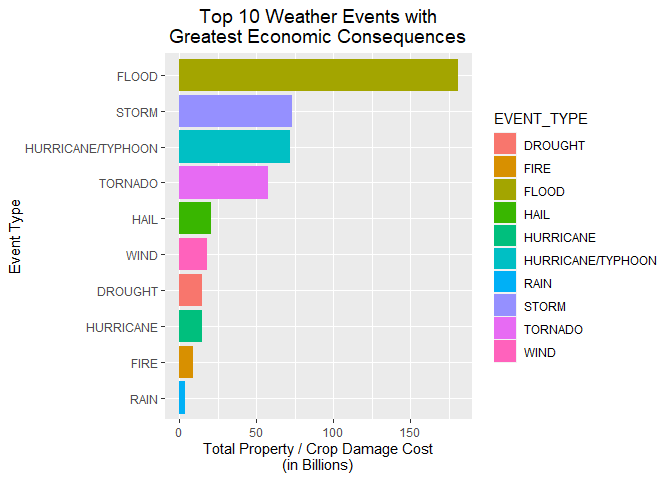

## Synonpsis

This project involves exploring the U.S. National Oceanic and Atmospheric Administration's (NOAA) storm database. This database tracks characteristics of major storms and weather events in the United States, including when and where they occur, as well as estimates of any fatalities, injuries, and property damage.

Property damage and crop damage cost estimates were used to determine weather events with the greatest economic consequences while the estimates obtained related to fatalities and injuries were used to determine weather events with the most harmful impact to population health.

This report contains the results of an analysis where the goal was to identify
the most shocking weather events with respect to population health and those
with the greatest economic impact in the U.S.

## Environment Setup & assumptions

knitr setup & environment.

```r
#knitr setup
knitr::opts_chunk$set(echo = TRUE, fig.path='figures/')
rm(list = ls(all.names = TRUE))
gc()
```

```
##          used (Mb) gc trigger (Mb) max used (Mb)
## Ncells 426594 22.8     899370 48.1   638940 34.2
## Vcells 785792  6.0    8388608 64.0  1633144 12.5
```

```r
#this is to disable scientific notation for numbers 
options(scipen = 1)

#required packages
library(ggplot2)
library(dplyr, warn.conflicts = FALSE)
library(xtable, warn.conflicts = FALSE)
```


**Assumptions**

* The working directory is already set
* The data is already unzipped and in the working directory
* The following packages(with their respective dependencies) are already installed: ggplot2, dplyr, xtable

If one or more packages are missing (or you are not so sure) it is possible to use the following code:

```r
#if (!require(ggplot2)) {
#    install.packages("ggplot2")
#    library(ggplot2)
#}
#if (!require(dplyr)) {
#    install.packages("dplyr")
#    library(dplyr, warn.conflicts = FALSE)
#}
#if (!require(xtable)) {
#    install.packages("xtable")
#    library(xtable, warn.conflicts = FALSE)
#}
```


## Load Data

As it is mentioned previously, make sure you are already in your working directory and that you have already downloaded and unzipped the Storm Data file, it is possible to found it <a href="https://d396qusza40orc.cloudfront.net/repdata%2Fdata%2FStormData.csv.bz2" target="_top">here.</a> or at the end of the document.

The code responsible of "reading" the data is shown below:

```r
storm_data_file <- "data/storm-data.csv.bz2"

storm_data <- read.csv(storm_data_file, sep = ",", header = TRUE)
```

In case it is neccesary to download it while executing the .Rmd file, it is possible to do that with the following lines: 

```r
#storm_data_file_url <- "https://d396qusza40orc.cloudfront.net/repdata%2Fdata%2FStormData.csv.bz2"
#storm_data_file <- "data/storm-data.csv.bz2"
#if (!file.exists('data')) {
#    dir.create('data')
#}
#if (!file.exists(storm_data_file)) {
#    download.file(url = storm_data_file_url, destfile = storm_data_file)
#}
#storm_data <- read.csv(storm_data_file, sep = ",", header = TRUE)
```

## Data Processing

### a) Create Subset of Data

When processing a large dataset, compute performance can be improved by taking a
subset of the variables required for the analysis. For this analysis, the
dataset will be trimmed to only include the necessary variables (listed below).
In addition, only observations with `value > 0` will be included.

| ID/Variable  | Description                                                |
|--------------|------------------------------------------------------------|
| CROPDMG      | Crop damage in USD                                         |
| END_DATE     | End date of the event                                      |
| PROPDMG      | Property damage in USD                                     |
| BGN_DATE     | Begin date of the event                                    |
| STATE        | State where the event occurred                             |
| INJURIES     | Number of injuries resulting from event                    |
| FATALITIES   | Number of fatalities resulting from event                  |
| CROPDMGEXP   | Unit multiplier for property damage (K, M, or B)           |
| PROPDMGEXP   | Unit multiplier for property damage (K, M, or B)           |
| EVTYPE       | Event type (Hurricane, Heat, Tornado, Flood, ...)          |


```r
storm_data_t <- subset(storm_data, EVTYPE != "?"
                                   &
                                   (FATALITIES > 0 | INJURIES > 0 | PROPDMG > 0 | CROPDMG > 0),
                                   select = c("EVTYPE",
                                              "FATALITIES",
                                              "INJURIES", 
                                              "PROPDMG",
                                              "PROPDMGEXP",
                                              "CROPDMG",
                                              "CROPDMGEXP",
                                              "BGN_DATE",
                                              "END_DATE",
                                              "STATE"))
dim(storm_data_t)
```

```
## [1] 254632     10
```

```r
sum(is.na(storm_data_t))
```

```
## [1] 0
```

The working (tidy) dataset contains 254632 observations, 10 variables and no
missing values.

### b) Filter Event Type related Data

There are a total of 487 unique Event Type values in the current tidy dataset.


```r
length(unique(storm_data_t$EVTYPE))
```

```
## [1] 487
```

At the time of working with the data, it was revealed that many values appeared to be similar,
however, they were written in  different ways (pluralization, spellings, misspellings, ...)

The dataset was normalized by converting all Event Type values to uppercase and
combining similar Event Type values into unique categories.


```r
storm_data_t$EVTYPE <- toupper(storm_data_t$EVTYPE)
```


```r
# BLIZZARD
storm_data_t$EVTYPE <- gsub('.*BLIZZARD.*', 'BLIZZARD',
                             storm_data_t$EVTYPE)
# CLOUD
storm_data_t$EVTYPE <- gsub('.*CLOUD.*', 'CLOUD',
                             storm_data_t$EVTYPE)
# AVALANCHE
storm_data_t$EVTYPE <- gsub('.*AVALANCE.*', 'AVALANCHE',
                             storm_data_t$EVTYPE)
# DUST
storm_data_t$EVTYPE <- gsub('.*DUST.*', 'DUST',
                             storm_data_t$EVTYPE)
# FIRE
storm_data_t$EVTYPE <- gsub('.*FIRE.*', 'FIRE',
                             storm_data_t$EVTYPE)
# DRY
storm_data_t$EVTYPE <- gsub('.*DRY.*', 'DRY',
                             storm_data_t$EVTYPE)
# FLOOD
storm_data_t$EVTYPE <- gsub('.*FLOOD.*', 'FLOOD',
                             storm_data_t$EVTYPE)
# HAIL
storm_data_t$EVTYPE <- gsub('.*HAIL.*', 'HAIL',
                             storm_data_t$EVTYPE)
# FOG
storm_data_t$EVTYPE <- gsub('.*FOG.*', 'FOG',
                             storm_data_t$EVTYPE)
# HYPOTHERMIA/EXPOSURE
storm_data_t$EVTYPE <- gsub('.*HYPOTHERMIA.*', 'HYPOTHERMIA/EXPOSURE',
                             storm_data_t$EVTYPE)
# LANDSLIDE
storm_data_t$EVTYPE <- gsub('.*LANDSLIDE.*', 'LANDSLIDE',
                             storm_data_t$EVTYPE)
# MICROBURST
storm_data_t$EVTYPE <- gsub('.*MICROBURST.*', 'MICROBURST',
                             storm_data_t$EVTYPE)
# WIND
storm_data_t$EVTYPE <- gsub('.*WIND.*', 'WIND',
                             storm_data_t$EVTYPE)
# VOLCANIC
storm_data_t$EVTYPE <- gsub('.*VOLCANIC.*', 'VOLCANIC',
                             storm_data_t$EVTYPE)
# WET
storm_data_t$EVTYPE <- gsub('.*WET.*', 'WET',
                             storm_data_t$EVTYPE)
# RIP CURRENT
storm_data_t$EVTYPE <- gsub('.*RIP CURRENT.*', 'RIP CURRENT',
                             storm_data_t$EVTYPE)
# RAIN
storm_data_t$EVTYPE <- gsub('.*RAIN.*', 'RAIN',
                             storm_data_t$EVTYPE)
# STORM
storm_data_t$EVTYPE <- gsub('.*STORM.*', 'STORM',
                             storm_data_t$EVTYPE)
# SUMMARY
storm_data_t$EVTYPE <- gsub('.*SUMMARY.*', 'SUMMARY',
                             storm_data_t$EVTYPE)
# SURF
storm_data_t$EVTYPE <- gsub('.*SURF.*', 'SURF',
                             storm_data_t$EVTYPE)
# MUDSLIDE
storm_data_t$EVTYPE <- gsub('.*MUDSLIDE.*', 'MUDSLIDE', storm_data_t$EVTYPE)
storm_data_t$EVTYPE <- gsub('.*MUD SLIDE.*', 'MUDSLIDE', storm_data_t$EVTYPE)

# LIGHTNING
storm_data_t$EVTYPE <- gsub('^LIGHTNING.*', 'LIGHTNING', storm_data_t$EVTYPE)
storm_data_t$EVTYPE <- gsub('^LIGNTNING.*', 'LIGHTNING', storm_data_t$EVTYPE)
storm_data_t$EVTYPE <- gsub('^LIGHTING.*', 'LIGHTNING', storm_data_t$EVTYPE)

# WINTER
storm_data_t$EVTYPE <- gsub('.*WINTER.*', 'WINTER', storm_data_t$EVTYPE)
storm_data_t$EVTYPE <- gsub('.*WINTRY.*', 'WINTER', storm_data_t$EVTYPE)
storm_data_t$EVTYPE <- gsub('.*SNOW.*', 'WINTER', storm_data_t$EVTYPE)

# TORNADO
storm_data_t$EVTYPE <- gsub('.*TORNADO.*', 'TORNADO', storm_data_t$EVTYPE)
storm_data_t$EVTYPE <- gsub('.*TORNDAO.*', 'TORNADO', storm_data_t$EVTYPE)
storm_data_t$EVTYPE <- gsub('.*LANDSPOUT.*', 'TORNADO', storm_data_t$EVTYPE)
storm_data_t$EVTYPE <- gsub('.*WATERSPOUT.*', 'TORNADO', storm_data_t$EVTYPE)

# HEAT
storm_data_t$EVTYPE <- gsub('.*HEAT.*', 'HEAT', storm_data_t$EVTYPE)
storm_data_t$EVTYPE <- gsub('.*WARM.*', 'HEAT', storm_data_t$EVTYPE)
storm_data_t$EVTYPE <- gsub('.*HIGH.*TEMP.*', 'HEAT', storm_data_t$EVTYPE)
storm_data_t$EVTYPE <- gsub('.*RECORD HIGH TEMPERATURES.*', 'HEAT', storm_data_t$EVTYPE)

# COLD
storm_data_t$EVTYPE <- gsub('.*COLD.*', 'COLD', storm_data_t$EVTYPE)
storm_data_t$EVTYPE <- gsub('.*FREEZ.*', 'COLD', storm_data_t$EVTYPE)
storm_data_t$EVTYPE <- gsub('.*FROST.*', 'COLD', storm_data_t$EVTYPE)
storm_data_t$EVTYPE <- gsub('.*ICE.*', 'COLD', storm_data_t$EVTYPE)
storm_data_t$EVTYPE <- gsub('.*LOW TEMPERATURE RECORD.*', 'COLD', storm_data_t$EVTYPE)
storm_data_t$EVTYPE <- gsub('.*LO.*TEMP.*', 'COLD', storm_data_t$EVTYPE)
```

After tidying the dataset, the number of unique Event Type values were reduced
to 81, for instance, it becomes easier to use. 


```r
length(unique(storm_data_t$EVTYPE))
```

```
## [1] 81
```

### c) Filter Economic related Data

According to the Storm Data Documentation, the information related to **Property Damage** is logged using two variables:
`PROPDMG` and `PROPDMGEXP`. `PROPDMG` is the mantissa rounded
to three significant digits and `PROPDMGEXP` represents the exponent.
The same approach is used for **Crop Damage** where the `CROPDMG` variable is
represented `CROPDMGEXP`.


```r
table(toupper(storm_data_t$PROPDMGEXP))
```

```
## 
##             -      +      0      2      3      4      5      6      7      B 
##  11585      1      5    210      1      1      4     18      3      3     40 
##      H      K      M 
##      7 231427  11327
```

```r
table(toupper(storm_data_t$CROPDMGEXP))
```

```
## 
##             ?      0      B      K      M 
## 152663      6     17      7  99953   1986
```

The documentation clarifies that the `PROPDMGEXP` and `CROPDMGEXP` are
supposed to contain an alphabetical character used to signify magnitude and
logs "K" for thousands, "M" for millions, and "B" for billions.

For costs-related calculations, the `PROPDMGEXP` and `CROPDMGEXP` variables
will be mapped to a multiplier factor which will be used to calculate the
actual costs for both property and crop damage. For that to happen two new variables will be
created to store damage costs:

* prop_cost
* crop_cost


```r
# function to get multiplier factor (depending on the character)
getMultiplier <- function(exp) {
    exp <- toupper(exp);
    if (exp == "-") 
      return (10^0);
    if (exp == "")  
      return (10^0);
    if (exp == "+") 
      return (10^0);
    if (exp == "?") 
      return (10^0);
    if (exp == "-") 
      return (10^0);
    
    if (exp == "0") 
      return (10^0);
    if (exp == "1") 
      return (10^1);
    if (exp == "2") 
      return (10^2);
    if (exp == "3") 
      return (10^3);
    if (exp == "4") 
      return (10^4);
    if (exp == "5") 
      return (10^5);
    if (exp == "6") 
      return (10^6);
    if (exp == "7") 
      return (10^7);
    if (exp == "8") 
      return (10^8);
    if (exp == "9") 
      return (10^9);
    
    if (exp == "H") 
      return (10^2);
    if (exp == "K") 
      return (10^3);
    if (exp == "M") 
      return (10^6);
    if (exp == "B") 
      return (10^9);
    
    return (NA);
}
# calculate crop damage and property damage costs (cost in billions)
storm_data_t$prop_cost <- with(storm_data_t, as.numeric(PROPDMG) * sapply(PROPDMGEXP, getMultiplier))/10^9
storm_data_t$crop_cost <- with(storm_data_t, as.numeric(CROPDMG) * sapply(CROPDMGEXP, getMultiplier))/10^9
```

### d) Join all Data (Summarize)

Create a summarized dataset of fatalities + injuries (health impact data).
Sort the results in descending order (by health impact).


```r
health_data_i <- aggregate(x = list(HEALTH_IMPACT = storm_data_t$FATALITIES + storm_data_t$INJURIES), 
                                  by = list(EVENT_TYPE = storm_data_t$EVTYPE), 
                                  FUN = sum,
                                  na.rm = TRUE)
health_data_i <- health_data_i[order(health_data_i$HEALTH_IMPACT, decreasing = TRUE),]
```

Create a summarized dataset of property damage + crop damage (damage impact costs).
Sort the results in descending order (by damage cost).


```r
damage_cost_data_i <- aggregate(x = list(DAMAGE_IMPACT = storm_data_t$prop_cost + storm_data_t$crop_cost), 
                                  by = list(EVENT_TYPE = storm_data_t$EVTYPE), 
                                  FUN = sum,
                                  na.rm = TRUE)
damage_cost_data_i <- damage_cost_data_i[order(damage_cost_data_i$DAMAGE_IMPACT, decreasing = TRUE),]
```

## Results

### a) Event Types with Greatest Economic Consequences
**Floods: causing the most property damage and crop damage costs (as shown in the analysis).**

```r
print(xtable(head(damage_cost_data_i, 10),
             caption = "Top 10 Weather Events with Greatest Economic Consequences"),
             caption.placement = 'top',
             type = "html",
             include.rownames = FALSE,
             html.table.attributes='class="table-bordered", width="100%"')
```

<!-- html table generated in R 4.0.5 by xtable 1.8-4 package -->
<!-- Sat Jun 26 19:08:17 2021 -->
<table class="table-bordered", width="100%">
<caption align="top"> Top 10 Weather Events with Greatest Economic Consequences </caption>
<tr> <th> EVENT_TYPE </th> <th> DAMAGE_IMPACT </th>  </tr>
  <tr> <td> FLOOD </td> <td align="right"> 180.59 </td> </tr>
  <tr> <td> STORM </td> <td align="right"> 73.29 </td> </tr>
  <tr> <td> HURRICANE/TYPHOON </td> <td align="right"> 71.91 </td> </tr>
  <tr> <td> TORNADO </td> <td align="right"> 57.43 </td> </tr>
  <tr> <td> HAIL </td> <td align="right"> 20.74 </td> </tr>
  <tr> <td> WIND </td> <td align="right"> 18.28 </td> </tr>
  <tr> <td> DROUGHT </td> <td align="right"> 15.02 </td> </tr>
  <tr> <td> HURRICANE </td> <td align="right"> 14.61 </td> </tr>
  <tr> <td> FIRE </td> <td align="right"> 8.90 </td> </tr>
  <tr> <td> RAIN </td> <td align="right"> 4.05 </td> </tr>
   </table>
<br />

```r
damage_cost_chart <- ggplot(head(damage_cost_data_i, 10),
                            aes(x = reorder(EVENT_TYPE, DAMAGE_IMPACT), y = DAMAGE_IMPACT, fill = EVENT_TYPE)) +
                            coord_flip() +
                            geom_bar(stat = "identity") + 
                            xlab("Event Type") +
                            ylab("Total Property / Crop Damage Cost\n(in Billions)") +
                            theme(plot.title = element_text(size = 14, hjust = 0.5)) +
                            ggtitle("Top 10 Weather Events with\nGreatest Economic Consequences")
print(damage_cost_chart)
```

<!-- -->

### b) Event Types Most Harmful to Population Health
**Tornadoes: greatest number of fatalities and injuries (as shown in the analysis).**

```r
print(xtable(head(health_data_i, 10),
             caption = "Top 10 Weather Events Most Harmful to Population Health"),
             caption.placement = 'top',
             type = "html",
             include.rownames = FALSE,
             html.table.attributes='class="table-bordered", width="100%"')
```

<!-- html table generated in R 4.0.5 by xtable 1.8-4 package -->
<!-- Sat Jun 26 19:08:19 2021 -->
<table class="table-bordered", width="100%">
<caption align="top"> Top 10 Weather Events Most Harmful to Population Health </caption>
<tr> <th> EVENT_TYPE </th> <th> HEALTH_IMPACT </th>  </tr>
  <tr> <td> TORNADO </td> <td align="right"> 97075.00 </td> </tr>
  <tr> <td> WIND </td> <td align="right"> 12822.00 </td> </tr>
  <tr> <td> HEAT </td> <td align="right"> 12392.00 </td> </tr>
  <tr> <td> FLOOD </td> <td align="right"> 10129.00 </td> </tr>
  <tr> <td> LIGHTNING </td> <td align="right"> 6048.00 </td> </tr>
  <tr> <td> STORM </td> <td align="right"> 4196.00 </td> </tr>
  <tr> <td> WINTER </td> <td align="right"> 1956.00 </td> </tr>
  <tr> <td> FIRE </td> <td align="right"> 1698.00 </td> </tr>
  <tr> <td> HAIL </td> <td align="right"> 1512.00 </td> </tr>
  <tr> <td> HURRICANE/TYPHOON </td> <td align="right"> 1339.00 </td> </tr>
   </table>
<br />


```r
health_chart <- ggplot(head(health_data_i, 10),
                            aes(x = reorder(EVENT_TYPE, HEALTH_IMPACT), y = HEALTH_IMPACT, fill = EVENT_TYPE)) +
                            coord_flip() +
                            geom_bar(stat = "identity") + 
                            xlab("Event Type") +
                            ylab("Total Fatalities and Injures") +
                            theme(plot.title = element_text(size = 14, hjust = 0.5)) +
                            ggtitle("Top 10 Weather Events Most Harmful to\nPopulation Health")
print(health_chart)
```

<!-- -->


## Code & Data Source

* <a href="https://d396qusza40orc.cloudfront.net/repdata%2Fpeer2_doc%2Fpd01016005curr.pdf" target="_top">National Weather Service: Storm Data Documentation</a>


* <a href="https://d396qusza40orc.cloudfront.net/repdata%2Fdata%2FStormData.csv.bz2" target="_top">Storm Data</a>

* <a href="https://github.com/Angel009/Reproducible_research_courseProject2" target="_top">Code of the project</a>
